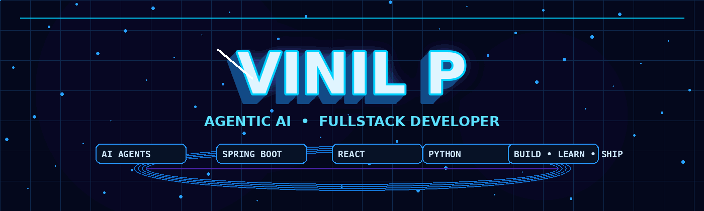

<div align="center">



# VINIL P

### 🤖 Agentic AI • FullStack Developer

<p>
  <a href="https://github.com/Vinil-Official">
    
  </a>
  <a href="https://www.linkedin.com/in/vinil-softwaredeveloper/">
    
  </a>
  <a href="mailto:YOUR_EMAIL@example.com">
    
  </a>
</p>

</div>

---

## ⚡ `01 // PROFILE`

<table>
<tr>
<td width="50%">

### 🧠 What I Build

- 🤖 Agentic AI applications
- 🌐 FullStack web applications
- 🧠 AI & Machine Learning solutions
- 📊 Data-driven applications
- ⚙️ Java / Spring Boot backends

</td>
<td width="50%">

### 🎯 Current Focus

```text
Agentic AI
LLM Applications
LangGraph
Spring Boot
React
Machine Learning
Cloud & Deployment
```

</td>
</tr>
</table>

---

## 🧩 `02 // TECH STACK`

<div align="center">

### Languages


### Frontend


### Backend


### AI / ML


### Database • Cloud • Tools


</div>

---

## 🚀 `03 // PROJECTS`

<table>
<tr>
<td width="50%">

### 🤖 Agentic AI Systems

Building intelligent agents that can reason, use tools and execute multi-step tasks.

</td>
<td width="50%">

### 🧠 AI / ML Projects

Machine learning and deep learning solutions for practical problems.

</td>
</tr>
<tr>
<td>

### 🌐 FullStack Applications

Modern React interfaces with scalable backend services.

</td>
<td>

### 📊 Data Science Projects

Data analysis, visualization and predictive modeling.

</td>
</tr>
</table>

---

## 📈 `04 // GITHUB`

<div align="center">


<br>


</div>

---

## 🖥️ `05 // ACTIVITY STREAM`

```text
┌──────────────────────────────────────────────────────┐
│ VINIL_RUNTIME                                        │
├──────────────────────────────────────────────────────┤
│ [✓] Building Agentic AI applications                 │
│ [✓] Developing Spring Boot services                  │
│ [✓] Exploring LLM + LangGraph workflows              │
│ [✓] Learning • Experimenting • Shipping              │
└──────────────────────────────────────────────────────┘
```

---

## 🔗 `06 // CONNECT`

<div align="center">

<a href="https://github.com/Vinil-Official">

</a>

<a href="https://www.linkedin.com/in/vinil-softwaredeveloper/">

</a>

</div>

<br>

<div align="center">

**Building intelligent systems. Learning continuously. Shipping boldly.**

</div>
